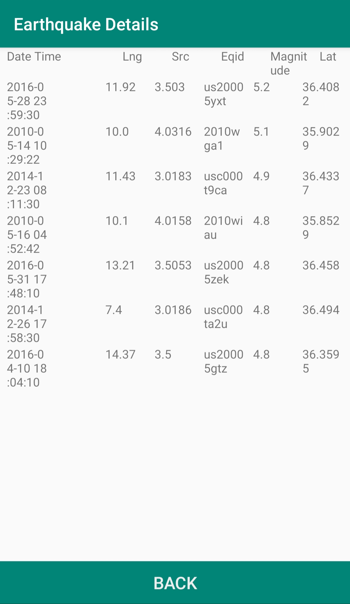

# Earthquake Places :mag_right:
Android App help you to search  to the earthquake places :city_sunrise: and view it in Maps with his details in table.

## Screenshots
| Main Screen | Earthquake Details |
|:-----------:|:------------------:|
|  |  |

## Requirements
* Internet connection.

## Contributing 💡
If you want to contribute to this project and make it better with new ideas, your pull request is very welcomed.
If you find any issue just put it in the repository issue section, thank you.
